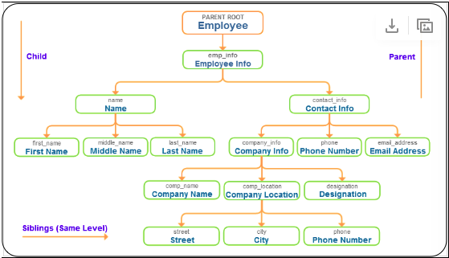

# XML
XML stands for Extensible Markup Language
* storing data records that are fully platform independent
* markup language same as html
* Customised user defined tags for storing data
* Xml just store data temporarily or permanently
* Data can be inserted or updated into database tables 

XML is used for rendering or connecting an application and database.

## XML structure
Xml has only one root element and starts from top. XML has a tree structure of data. Tree structure has one root, child elements, branches, attributes, values.

XML can create customized nested tags to maintain tree structure.

```
<employee>
  <emp_info id="1">
    <name>
      <first_name>Opal</first_name>
      <middle_name>Venue</middle_name>
      <last_name>Kole</last_name>
    </name>
    <contact_info>
      <company_info>
        <comp_name>Odoo (formally OpenERP)</comp_name>
        <comp_location>
          <street>Tower-1, Infocity</street>
          <city>GH</city>
          <phone>000-478-1414</phone>
        </comp_location>
        <designation>Junior Engineer</designation>
      </company_info>
    <phone>000-987-4745</phone>
    <email>email@myemail.com</email>
    </contact_info>
  </emp_info>
</employee>
```

<div align="center"></div>

___
## XML rules
1. XML documents have only one root element
```
<root>
  <element>
    <subelement>...</subelement>
  </element>
</root>
```

2. Every element has a closing tag
```
<name>Opal Kole             <!-- Invalid -->
<name>Opal Kole</name>      <!-- Valid -->
```

3. Every element must have property nested
```
<contact_info>
  <name>Opal Kole </contact_info> </name>   <!-- Invalid -->

<contact_info>
  <name>Opal Kole</name>
</contact_info>                             <!-- Valid -->
```

4. Comments in XML
```
<!-- This is a comment text -->
```

5. XML tags are case sensitive
```
<name>Opal Kole<Name>   <!-- Invalid -->

<name>Opal Kole<name>   <!-- Valid -->
<Name>Opal Kole<Name>   <!-- Valid -->
<NAME>Opal Kole<NAME>   <!-- Valid -->
```

6. XML attribute value must be quoted
```
<emp_info id=1>
    <name>Opal Kole</name>
</emp_info>           <!-- Invalid -->

<emp_info id="1">
    <name>Opal Kole</name>
</emp_info>           <!-- Valid -->
```

7. White space is not preserved in XML
```
<name>Opal       Kole<name>   <!-- Valid -->
```

8. Entity support: if you use < and > signs inside tags, it will interpret that it is a new element and will generate an error.
```
<emp_info>employee number < 15 </emp_info>     <!-- Invalid -->
```
9. For avoiding this error use entity character instead of some special character (<, >). 
```
<emp_info>employee number &lt; 15 </emp_info>   <!-- Valid -->
```

## XML elements vs attributes
Difference between element and attribute : attributes are part of the markup and elements are part of the document to store data.
```
<emp_info id="1">   <!-- Attributes represent-->
  ...
<emp_info>

<emp_info>          <!-- Elements represent-->
  <id>1</id>
<emp_info>
```

## XML elements
Element names must be alphabetic or numeric character contains. Element name can't have white spaces contains and name can't start with capital letter, numeric or mixed letter. 

## XML attributes
XML attributes specified by name="value" pair inside the starting element. XML attribute values must be quoted. XML standard specifies element may have define multiple attributes along with unique attribute name.


# XSL
XSL (Extensible stylesheet language) is a family of recommendations for defining XML  document transformation and presentation. XSLT stands for extensible style language transfer. 

## XSLT Transform
First the document type is defined along with document encoding
```
<?xml version="1.0" encoding="ISO-8859-1"?>
```

Specifies the XSL Style Sheet and define the output method in ***xsl:output*** tag. Default output method is XML otherwise explicitly specify either TEXT or HTML.
Optionally you can also specifies the ***indent*** attribute to produce indented spaced XML output.
```
<xsl:stylesheet xmlns:xsl="http://www.w3.org/1999/XSL/Transform" version="1.0">
  ...
  <xsl:output method="html" indent="yes"/>
  ...
</xsl:stylesheet>
```

You can also define define templates containing match attributes (acts as a filter)
Every ***xsl:template*** tag contains ***match*** attributes.
***xsl:apply-templates*** process the children of the current node. In our case root element is current node.
```
<xsl:template match="/">
    <html><body>
      <xsl:apply-templates/>
    </body></html>
  </xsl:template>
```

### Processing the child element
Now adding a child ***HEADING*** tag you have to add new template. In ***match*** attribute you have to write full XPATH from the root element or simple write tag name. 

```
<xsl:template match="/PAGE/HEADING">
    <h1 align="center"> <xsl:apply-templates/> </h1>
</xsl:template>
```

